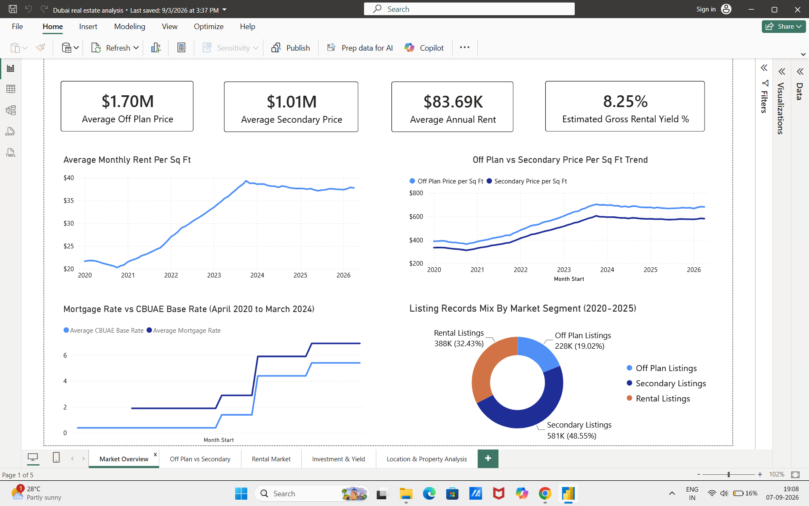
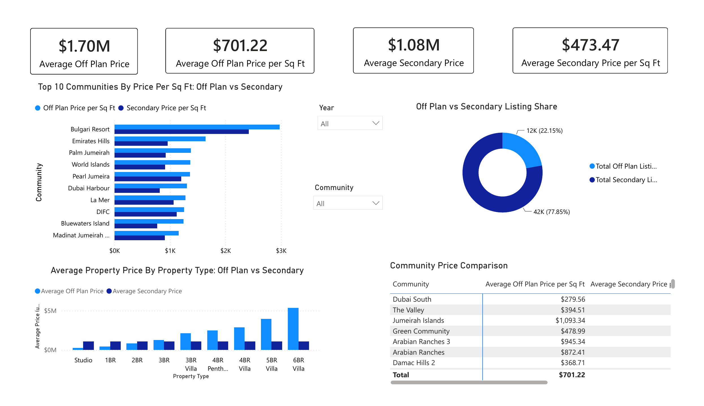
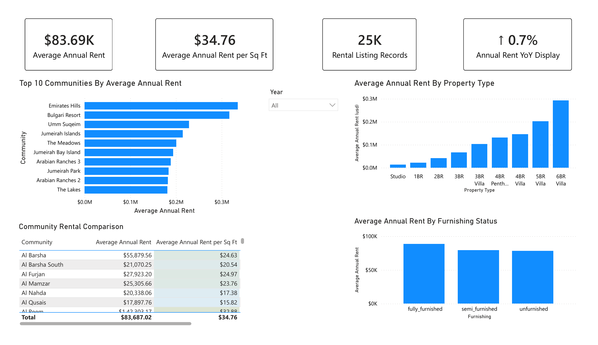
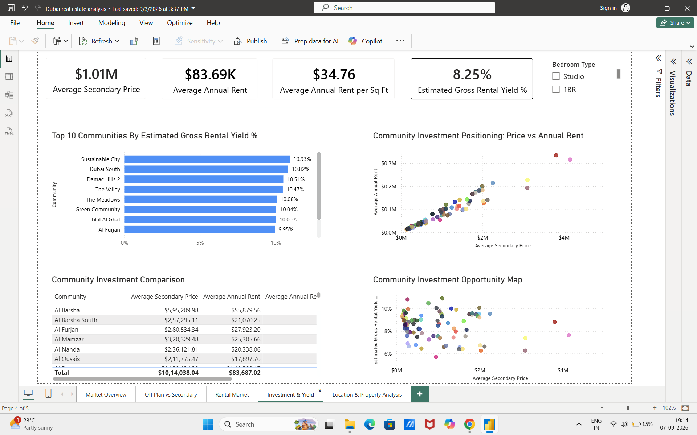
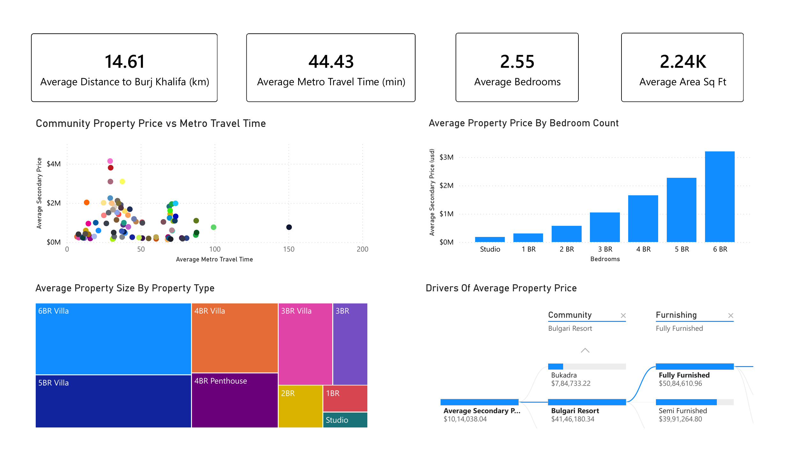

# Dubai Real Estate Market Analysis

An end-to-end Power BI analysis of Dubai’s real estate market, transforming multi-source property data into actionable insights on pricing, rental performance, off-plan premiums, estimated gross rental yields, market activity, and location-driven investment opportunities.

## Project summary

The solution combines five source datasets into a star-schema-oriented semantic model containing four fact tables, five conformed dimensions, 14 active many-to-one relationships, and five business-focused report pages.

The dataset contains realistically calibrated, modelled listing-level records with real geographic and market anchors. Results demonstrate analytical and Power BI capabilities and should not be interpreted as official Dubai Land Department transaction statistics.

## Dashboard pages

### 1. Market Overview



### 2. Off Plan vs Secondary



### 3. Rental Market



### 4. Investment and Yield



### 5. Location and Property Analysis




## Business questions

1. Is Dubai property pricing becoming more expensive over time?
2. Are off-plan properties priced at a premium to secondary-market properties?
3. Which communities are the most expensive, and which show stronger rental-yield potential?
4. How do property type, bedroom count, property size, and accessibility relate to secondary-market prices?

## Report pages

| Page | Analytical focus | Examples |
| --- | --- | --- |
| Market Overview | Overall market direction | Price and rent trends, financing rates, annual listing activity |
| Off Plan vs Secondary | Primary-versus-resale pricing | Price-per-square-foot premium, listing share, community and property-type comparison |
| Rental Market | Rental performance | Rent levels, annual rent per sq ft, furnishing, community comparison and year-over-year movement |
| Investment & Yield | Investment screening | Estimated gross yield, price-versus-rent positioning and community opportunities |
| Location & Property Analysis | Secondary-market property and accessibility | Property price, metro travel time, bedrooms, size and key price drivers |

## Key findings

- Average off-plan property price is approximately **$1.70M**, compared with **$1.01M** for secondary-market properties.
- Average annual rent is approximately **$83.69K**.
- The portfolio-level estimated gross rental yield is approximately **8.25%**.
- Off-plan price per sq ft remains above the secondary-market benchmark, supporting the premium analysis.
- Luxury communities do not automatically provide the highest estimated yields; entry price and rental income must be evaluated together.
- Average property price increases materially with bedroom count, while property type and size further explain market segmentation.
- Accessibility varies across communities; metro travel time and distance from Burj Khalifa provide an additional location lens.
- Data for 2026 is available only through April and must be interpreted as partial-year or year-to-date information.

## Data model

### Fact tables

- `Off Plan` — 12,000 listing-level records
- `Rentals` — 25,000 listing-level records
- `Secondary Sales` — 50,000 listing-level records
- `Area Prices Monthly` — 6,384 community-by-month records

### Conformed dimensions

- `Dim Date`
- `Dim Community`
- `Dim Project`
- `Dim Metro Station`
- `Dim Bedrooms`

All 14 relationships are active, many-to-one, and single-direction. The model contains no fact-to-fact relationships. `Dim Bedrooms` provides one shared bedroom slicer for Rentals and Secondary Sales.

## Analytical approach

- Full-dataset profiling and data-quality review
- Power Query cleaning, type correction and naming standardisation
- Star-schema-oriented dimensional modelling
- Reusable DAX measures and time-intelligence calculations
- Same-period prior-year comparisons for partial 2026 data
- Interactive slicers, tooltips, conditional formatting and decomposition analysis
- Semantic-model clean-up by hiding redundant technical fields and removing temporary measures

## Important metric definitions

- **Off-plan price-per-sq-ft premium:** compares average off-plan price per sq ft with the secondary-market benchmark under the current filter context.
- **Estimated gross rental yield:** average annual rent divided by average secondary-market price under the same filter context.
- **Rental listing records:** number of rows in the Rentals table under the active filters; it does not represent confirmed unique physical properties.

## Limitations

- The source contains synthetic/modelled listing records and is intended for analytical demonstration.
- Estimated gross yield compares aggregated rental and secondary-market averages; properties are not matched at unit level.
- 2026 data is partial through April.
- Financing-rate analysis uses the common period from April 2020 through March 2024.
- Secondary Sales floor-related fields contain approximately 36% missing values.

## Tools and skills demonstrated

`Power BI Desktop` · `Power Query` · `DAX` · `Dimensional Modelling` · `Data Profiling` · `Time Intelligence` · `Data Visualisation` · `Business Analysis`

## Repository contents

```text
Dubai_Real_Estate_Market_Analysis/
├── README.md
├── LICENSE
├── .gitignore
├── Documentation/
│   ├── Dubai_Real_Estate_PowerBI_Case_Study.docx
│   └── Dubai_Real_Estate_PowerBI_Case_Study.pdf
├── DAX-Measures/
│   └── DAX_Measures.md
├── Data-Dictionary/
│   └── Data_Dictionary.md
├── Dataset/
│   └── Data_Source.md
├── Screenshots/
│   ├── 01_Market_Overview.png
│   ├── 02_Off_Plan_vs_Secondary.png
│   ├── 03_Rental_Market.png
│   ├── 04_Investment_and_Yield.png
│   └── 05_Location_and_Property_Analysis.png
└── Power-BI-Report/
    └── Dubai_Real_Estate_Market_Analysis.pbix
```

The final interactive report is included in the `Power-BI-Report` folder. Open it with Power BI Desktop to use the complete filters, tooltips and drill interactions.

## Data source

Dataset: **Dubai Real Estate: Sales, Off-Plan & Rentals (2020–2026)** by Kaggle user **sergionefedov**. See [Data_Source.md](Dataset/Data_Source.md) for attribution, licence and usage notes.


## Licence

The project code, DAX measures and original documentation are released under the [MIT License](LICENSE). The source dataset remains subject to its original licence; see [Data_Source.md](Dataset/Data_Source.md) for details.


## Author

Vaibhav Soni
